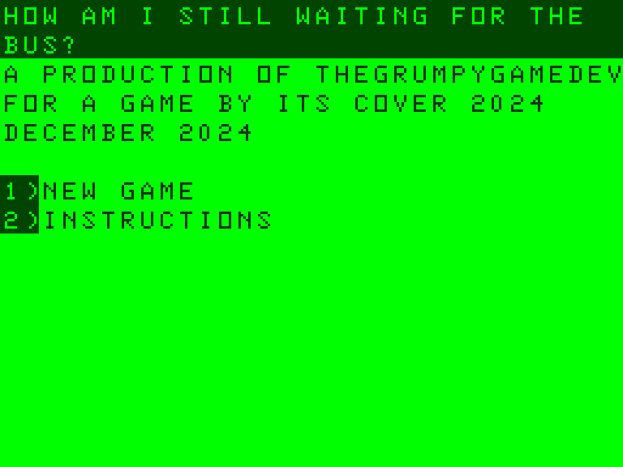
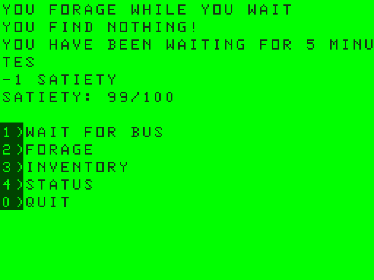
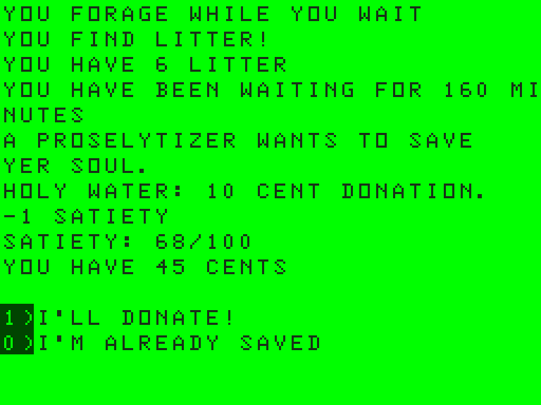
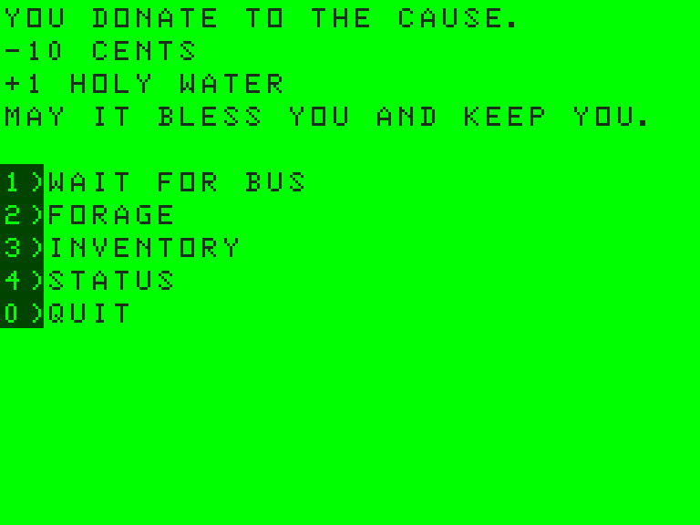
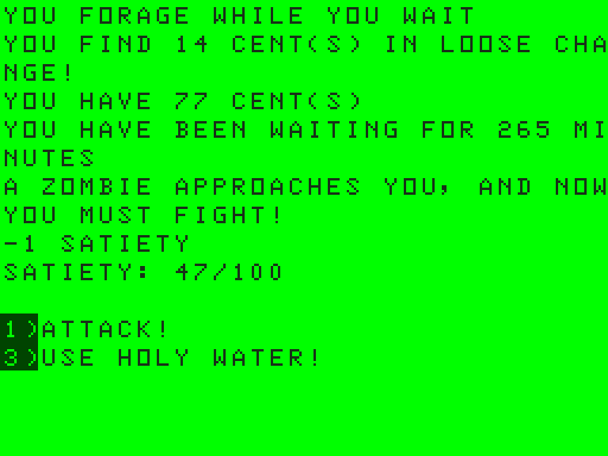
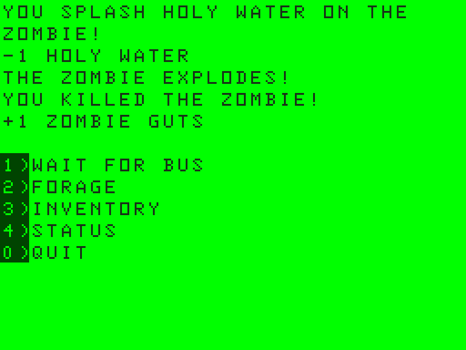
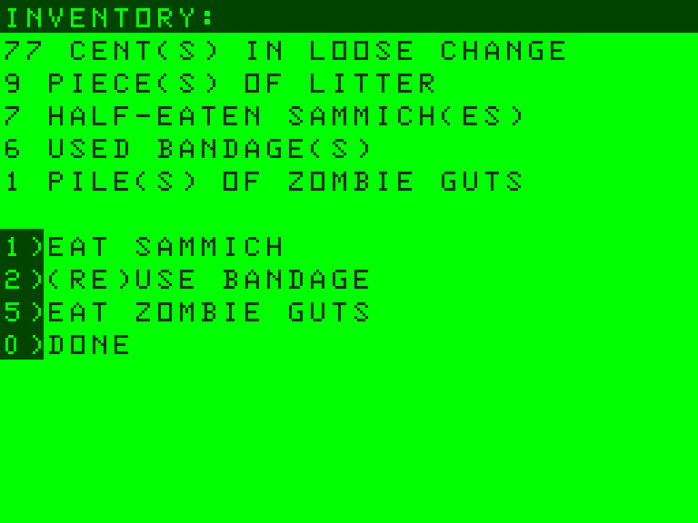
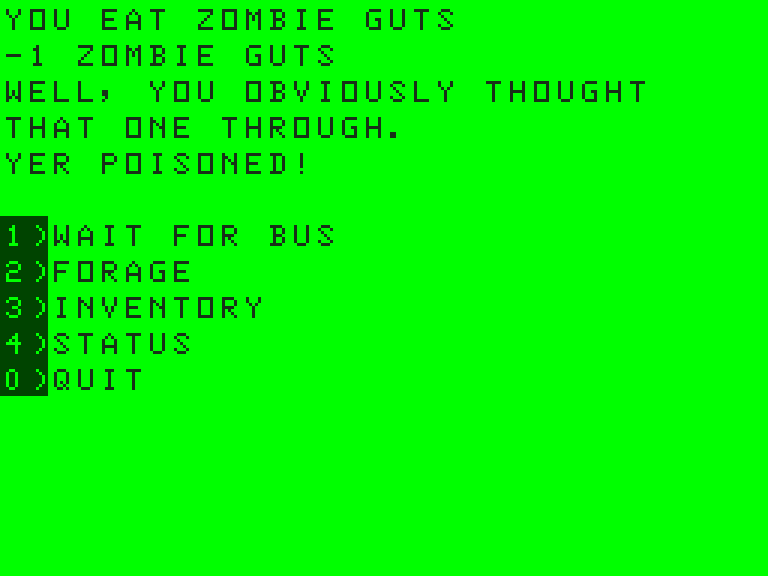
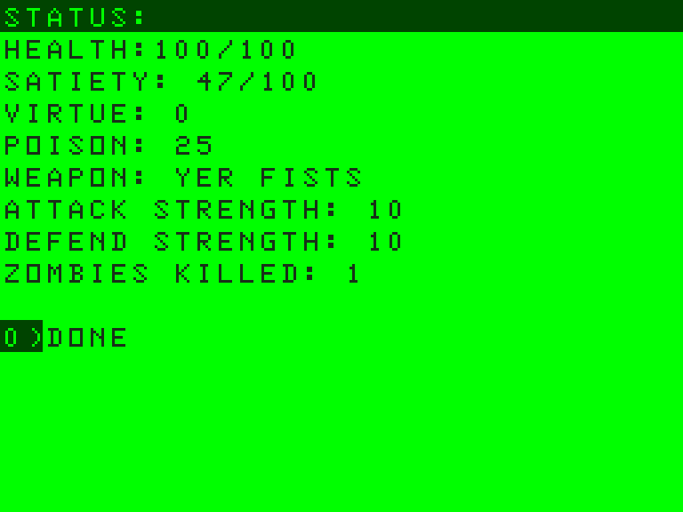
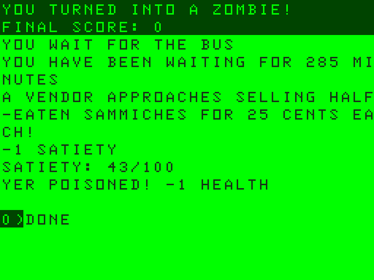

# Still waiting for the bus (now in Odin, now with holy water)

*October 5, 2026*

Yer still at the bus stop. The bus has not arrived. This is, as far as I can tell, working as intended.

## The rewrite

The whole game has been rewritten from scratch in Odin and compiled to WebAssembly. It was a Lua game on the Defold engine, and now it is a small Odin program that runs in yer browser with a few lines of JavaScript to draw it.

It is the same game. I ported it line for line and kept the quirks: the 32-column screen, the hand-padded messages, the way a sammich fixes a lot of things but not everything. If you played the old version, you will not notice a difference until the new stuff turns up.

## Touch controls

You can now play it on a phone. Tap a menu line and it does the same thing as pressing its number. The old version wanted a keyboard.

## New: the proselytizer

Sometimes, while yer waiting, a proselytizer turns up. He wants to save yer soul. Holy water is a 10 cent donation, and the donation is totally voluntary. If yer broke, he will let you go on yer way, praying for you.

Pay him and you get a vial of holy water.

## New: holy water

Holy water is for zombies. Throw it on one in a fight and the zombie explodes. That counts as a kill. It also leaves behind a pile of zombie guts.

## New: zombie guts

You can pick up the guts. They sit in yer inventory, and you can eat them.

You should not eat them.

Eating them poisons you. Poison starts at 25. Each time yer hunger ticks, you lose a point of poison and a point of health. Eating more guts does not stack it; it just puts you back at 25. While it lasts, it shows on the status screen.

If you die while yer poisoned, whatever the cause, it does not end there.

## Fixes

- The first version of the proselytizer had a bug: too much text on the screen pushed the last menu lines off the bottom, so on some turns the option to donate was missing. The screen now scrolls when it fills up, so the menu is always there and it is the oldest lines at the top that go.
- A few messages wrapped in the wrong place. They don't any more.

## Credits

The font was captured from the [VCC (Virtual Color Computer)](https://github.com/VCCE/VCC) emulator, whose character set is by Joseph Forgione and is licensed GPL-3.0. That makes the font image GPL-3.0, and the source for the game is [on GitHub](https://github.com/playdeezgames/TGGD_AGBIC24). The rest of it is MIT.

I wrote this with Claude Code, which did most of the typing.

## What's next

There is one idea left on the list: zombie guts that distract a zombie from attacking. I have not decided what that costs yet.

Thanks for engaging with my metaphor.
